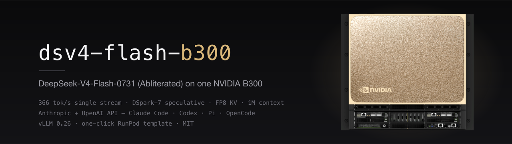

[](https://github.com/luka-loehr/dsv4-flash-b300/releases/latest)
[](cloudflare/README.md)
[](https://vllm.ai)
[](https://developer.nvidia.com/cuda-toolkit)
[-76B900?style=flat&logo=nvidia&logoColor=white)](https://www.nvidia.com)
[](https://claude.com/claude-code)
[](docs/HARNESSES.md)
[](LICENSE)

**Pull one image, run it on a Blackwell GPU, and it serves — no volume, no start
command.** The [`prem-research/DeepSeek-V4-Flash-0731-abliterated`](https://huggingface.co/prem-research/DeepSeek-V4-Flash-0731-abliterated)
checkpoint (156 GB), the vLLM 0.26 runtime (DSpark-7 speculative decoding, FP8 KV
cache), **and** a large FlashInfer cubin cache are all baked into the image. It
serves **both the Anthropic Messages API and the OpenAI API**, so your favourite
agent CLI — **Claude Code, Codex, Pi, OpenCode, Aider** — connects straight to it.

> **Honest cold-start.** Nothing is downloaded from a model hub, but a *fresh* pod
> is not instant: it pulls + unpacks the ~185 GB image, loads 156 GB into HBM, and
> **JIT-compiles the MoE/attention kernels on first serve** (some FlashInfer cubins
> and TileLang/DeepGEMM shapes compile on demand). Measured end-to-end on a fresh
> B300: **~69 min to first health-200.** See [§5](#5-boot-time--cost) for the real
> breakdown and how to shrink it.

```bash
docker run --gpus all -p 8000:8000 dsv4-registry.lukaloehr.com/dsv4-flash-b300:1.0.0
```

> **What this is.** A self-contained serving image. Nothing to build, download, or
> mount at run time. The MIT-licensed checkpoint is included in the image; the
> abliteration (ARA) is upstream. Use it for authorized work.

**Published image:** `dsv4-registry.lukaloehr.com/dsv4-flash-b300:1.0.0` — ~185 GB,
served from a **Cloudflare R2-backed registry**. The pull is **public, needs no
credential, and is not rate-limited** — that is deliberate: GHCR throttles its
blob endpoint hard enough that a 185 GB parallel pull never finishes on RunPod, so
the image is served from R2 instead ([why](cloudflare/README.md)). You only pay for
the B300 while it runs, plus the ~185 GB pull + unpack on each fresh pod — RunPod
caches images **per host**, so a stop/start of the *same* pod skips it, but a new
pod may land on a different host and re-pull (see [§5](#5-boot-time--cost)).

---

## 1. Quickstart (RunPod)

1. **Create the template** (once): `runpodctl doctor && ./runpod/create-template.sh`.
   No registry credential is needed — the pull is public.
2. **Deploy** the template on a **B300**. No volume, no start command:
   ```bash
   runpodctl pod create --template-id <id> --gpu-id "NVIDIA B300 SXM6 AC" \
     --data-center-ids EU-NL-1 --ports "8000/http,22/tcp" --container-disk-in-gb 40
   ```
3. **Read the pod log** — no SSH. It prints the endpoint
   `https://<pod-id>-8000.proxy.runpod.net`, your API key, and copy-paste setup
   for every agent CLI.

**Connect from your Mac:**
```bash
./client/install.sh    # asks for the pod URL + API key, installs the launchers
cc-dsv4                # Claude Code   (or codex-dsv4 · pi-dsv4 · opencode-dsv4 · aider-dsv4)
```

Not on RunPod? Anywhere with a Blackwell GPU + Docker:
`docker run --gpus all -p 8000:8000 dsv4-registry.lukaloehr.com/dsv4-flash-b300:1.0.0`
(add `--max-concurrent-downloads` to your Docker daemon config to parallelize the pull).

---

## 2. Works with any agent CLI

[](https://claude.com/claude-code)
[](https://developers.openai.com/codex)
[](https://github.com/earendil-works/pi)
[](https://opencode.ai)
[](https://aider.chat)

vLLM serves **two wire APIs at once** — the Anthropic Messages API (`/v1/messages`)
and the OpenAI API (`/v1/chat/completions`) — so essentially any terminal coding
agent works. `client/install.sh` installs one launcher per tool; each points its
CLI at the same endpoint with your API key.

| Agent CLI | Wire API | Launcher |
| :--- | :--- | :--- |
| [Claude Code](https://claude.com/claude-code) | Anthropic `/v1/messages` | `cc-dsv4` |
| [Codex CLI](https://developers.openai.com/codex) | OpenAI `/v1` (responses) | `codex-dsv4` |
| [Pi](https://github.com/earendil-works/pi) | OpenAI `/v1` | `pi-dsv4` |
| [OpenCode](https://opencode.ai) | OpenAI `/v1` | `opencode-dsv4` |
| [Aider](https://aider.chat) | OpenAI `/v1` | `aider-dsv4` |
| any OpenAI-compatible tool | OpenAI `/v1` | point it at `<pod-url>/v1`, model `dsv4` |

Each pod gets its **own API key** — generated on boot and printed in the pod log
(or set your own with `-e DSV4_API_KEY=…`). Per-tool setup: [docs/HARNESSES.md](docs/HARNESSES.md).

---

## 3. Measured performance

Tested live on a single NVIDIA B300 SXM6 AC (275 GB HBM3e @ 8.0 TB/s):

| Metric | Measured value | Notes |
| :--- | :---: | :--- |
| **Context window** | **1,048,576 tokens (1M)** | DeepSeek-V4 native position embeddings (config) |
| **Max generation** | **131,072 tokens (128k)** | Per-request generation cap (config) |
| **Output throughput** | **≈276 tok/s** | Single-stream, warm shape, 700-token generation (verified 2026-08-31) |
| **Short-gen throughput** | **≈130–160 tok/s** | ≤200-token replies — lower because TTFT is a larger share |
| **First-token latency (TTFT)** | **~60 ms** | Warm shape, short prompt |
| **Speculative mean acceptance** | **3.79 tokens** | DSpark-7 (`draft_sample_method: probabilistic`), via `bench.sh` |
| **Draft acceptance** | **pos-1 81.1% · overall 39.9%** | Multi-layer Markov-head draft modules, via `bench.sh` |
| **Cached prefill** | **5,853.9 tok/s** | FlashInfer DS-MLA with prefix caching, via `bench.sh` |
| **KV cache capacity** | **2,978,316 tokens** | FP8 KV (79.3 GB, 2.84× concurrent 1M ctx) |

Throughput varies with speculative-decode acceptance, which is prompt-dependent.
The rows marked *via `bench.sh`* come from the detailed benchmark in
[`scripts/bench.sh`](scripts/bench.sh); the throughput/TTFT rows were re-verified
live on 2026-08-31. **Note:** the *first* request at any new context-size bucket
compiles its kernels on demand and briefly stalls (down to single-digit tok/s),
then runs at full speed once cached — see [§5](#5-boot-time--cost).

---

## 4. Architecture

```text
MacBook (macOS)
  │  cc-dsv4  →  Claude Code CLI
  │  ANTHROPIC_BASE_URL = https://<pod-id>-8000.proxy.runpod.net
  ▼
RunPod HTTPS proxy (port 8000)
  ▼
vLLM 0.26.0  ──  native Anthropic Messages API  (/v1/messages, drop-in for Claude Code)
  ├── Tokenizer:        deepseek_v4
  ├── Attention:        FlashInfer MLA (TRTLLM-GEN), FP8 DS-MLA + FP4 Lightning-Indexer cache
  ├── Speculation:      DSpark-7 — mtp.{0,1,2} draft weights + rank-256 Markov head
  ├── MoE:              FlashInfer TRTLLM-GEN MXFP4 / MXFP8
  └── Dense MM:         DeepGEMM block-scaled FP8 (UE8M0)
  ▼
DeepSeek-V4-Flash-0731 Abliterated  ·  156 GB checkpoint baked into the image
  ▼
1× NVIDIA B300 SXM6 AC (275 GB HBM3e @ 8.0 TB/s)
```

The image itself is served from a Cloudflare R2-backed registry — see
[cloudflare/README.md](cloudflare/README.md) for that path — and is built **without
GHCR at all**: the runtime comes from Docker Hub (pytorch) + PyPI (vLLM) + NVIDIA
(cubins), the model is tarred off the volume as uncompressed layers, and both land
in R2 ([docs/RUNPOD-TEMPLATE.md](docs/RUNPOD-TEMPLATE.md)). Claude Code speaks the
Anthropic Messages API; vLLM 0.26 serves `/v1/messages` natively alongside the
OpenAI routes, so no translation proxy is involved.

---

## 5. Boot time & cost

Nothing is pulled from a model hub, but a fresh B300 is **not** instant. Measured
end-to-end, deploy → first `/health` 200 = **~69 min** (single fresh pod, 2026-08-31).
The phases, with real numbers:

1. **Pull** ~185 GB from R2 — fast and un-throttled (measured **up to 15 Gbit/s**).
2. **Extract** the layers to the container disk — **disk-write-bound** (~a few
   hundred MB/s on RunPod's overlay), the biggest single chunk (**~30+ min** for
   156 GB). Layers ship *uncompressed* (plain `tar`, no gzip) so there's no inflate
   pass — but the disk write itself dominates. This is inherent to baking a 156 GB
   model into an image; a network volume would trade it for a mount.
3. **Load weights → HBM** — **~9 min** (measured 528 s for 157 GiB).
4. **First-serve JIT compile** — **~20+ min the first time.** vLLM/FlashInfer fetch
   the remaining `batched_gemm` cubin headers from NVIDIA and **compile the MoE /
   attention / TileLang / DeepGEMM kernels with `ptxas` on demand** (one heavy
   `batched_gemm` ptxas compile alone was ~10 min), then autotune the FP4 MoE
   kernel. This is the honest gap behind "zero downloads": the cubin prefetch baked
   into the image is *partial* (NVIDIA's artifactory throttles a full bake), so the
   uncompiled shapes finish at first serve.

**After boot, cold request shapes still compile once.** The first request at a new
context-size bucket triggers a synchronous kernel compile and stalls to single-digit
tok/s for that turn, then caches and runs at full speed (~276 tok/s). A CLI with a
big system prompt + tools (e.g. Pi) hits a couple of these on its first turns, then
settles.

**Shrinking it (roadmap).** Two fixes remove almost all of phase 4 and the runtime
stalls: (a) a *resumable, un-timed* cubin prefetch at build so nothing fetches at
runtime; (b) **warm every shape bucket at build** — run representative prompts
during the image build so all `mhc_*`/DeepGEMM/TileLang/`batched_gemm` kernels
compile, then bake the full JIT cache. That collapses cold-start to pull + extract +
the ~9 min HBM load, with no compile stalls for any CLI.

Stop the pod to release GPU billing. RunPod caches images **per host**, so a
stop/start of the *same* pod skips the pull+extract, but a new pod may land on a
different host and re-pull — budget pull+extract per fresh deploy.

---

## 6. Scripts

| File | Purpose |
| :--- | :--- |
| [`containers/Dockerfile`](containers/Dockerfile) | Runtime layer: vLLM 0.26 + FlashInfer cubins + scripts + entrypoint (built in CI). |
| [`containers/entrypoint.sh`](containers/entrypoint.sh) | Image entrypoint: SSH → key → serve → print endpoint. Everything baked. |
| [`ops/build-to-r2.sh`](ops/build-to-r2.sh) · [`ops/build-on-runpod.sh`](ops/build-on-runpod.sh) | Build the all-in-one image off the mounted checkpoint volume and upload it straight to R2 — no model download. |
| [`cloudflare/`](cloudflare/README.md) | The R2-backed registry that serves the image: Worker, R2 push, one-time setup. |
| [`runpod/create-template.sh`](runpod/create-template.sh) | Create the RunPod template for the image. |
| [`scripts/start-vllm.sh`](scripts/start-vllm.sh) `fast\|safe` | Start vLLM. `fast` = DSpark-7 + FP4 indexer + CUDA graphs; `safe` = diagnostic. |
| [`scripts/stop-vllm.sh`](scripts/stop-vllm.sh) · [`health-check.sh`](scripts/health-check.sh) · [`bench.sh`](scripts/bench.sh) | Stop, status, and single-stream benchmark. |
| [`client/install.sh`](client/install.sh) | Install the Mac launchers (`cc-dsv4`, `codex-dsv4`, `pi-dsv4`, `opencode-dsv4`, `aider-dsv4`). |

---

## 7. Model & quantization

- **Model**: [`prem-research/DeepSeek-V4-Flash-0731-abliterated`](https://huggingface.co/prem-research/DeepSeek-V4-Flash-0731-abliterated) (156 GB native checkpoint).
- **Dense weights**: block-128 FP8 (`e4m3`) with DeepGEMM.
- **MoE experts**: block-32 packed FP4 (`e2m1`) via FlashInfer TRTLLM-GEN.
- **Speculative decoding**: DSpark draft weights from `mtp.{0,1,2}.*` with a
  rank-256 Markov head (`dspark_markov_rank: 256`, target layers `[40,41,42]`).
- **Attention**: FlashInfer MLA with native `fp8_ds_mla` + FP4 Lightning-Indexer cache.

The abliteration itself is upstream (ARA — refusal steering with low capability
drift); this repo is only the serving stack. Use it for authorized work.

---

## 8. Docs

- [cloudflare/README.md](cloudflare/README.md) — the R2-backed image registry (why, how, reproduce).
- [docs/RUNPOD-TEMPLATE.md](docs/RUNPOD-TEMPLATE.md) — the one-click template, end to end.
- [docs/HARNESSES.md](docs/HARNESSES.md) — connect Claude Code, Codex, Pi, OpenCode, Aider (and any OpenAI-compatible tool).
- [docs/CLAUDE-CODE.md](docs/CLAUDE-CODE.md) — Claude Code specifics.
- [docs/ARCHITECTURE.md](docs/ARCHITECTURE.md) — serving stack internals.
- [docs/SPECULATIVE-DECODING.md](docs/SPECULATIVE-DECODING.md) — DSpark-7 detail.
- [docs/ATTENTION-AND-KERNELS.md](docs/ATTENTION-AND-KERNELS.md) — MLA + MoE kernels.
- [docs/RUNBOOK.md](docs/RUNBOOK.md) — operational quick reference.

---

## License

[MIT](LICENSE) © 2026 Luka Löhr. The DeepSeek-V4-Flash weights and the upstream
abliteration are the property of their respective authors and are not included
or redistributed here.
